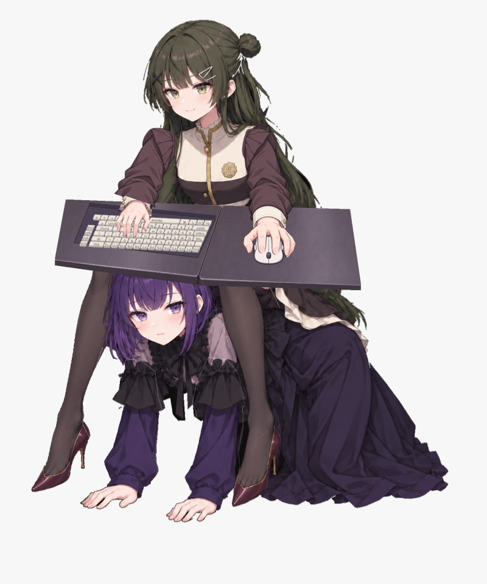
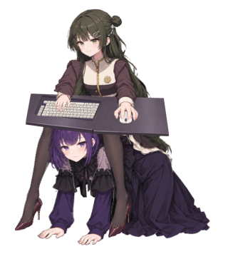

# Viola终稿 · Viola Desktop

一个原生桌面伙伴：薇欧拉坐在紫色伙伴身上，随着物理键位、鼠标移动和点击做出动作，并有大笑、闲置爬行和回位动画。当前公开源码版本为 **0.2.50**（build 51）。macOS 使用 Swift/AppKit，Windows 移植使用 .NET/WPF，具体功能与验证范围分别说明。



[查看 8 秒大笑动画预览（GIF，约 12.9 MB）](docs/images/laugh.gif)

本项目使用**非官方二创素材**，相关角色、图片与音频权利归各自权利人所有。**如侵权必删。** 权利人可通过[仓库 Issues](https://github.com/tlt-ops/viola-desktop/issues)联系维护者，维护者会及时处理并删除侵权素材。

## 下载

下载见 [Releases](https://github.com/tlt-ops/viola-desktop/releases)：macOS 包为 `viola-macos.zip`，Windows x64 包为 `viola-windows-win-x64.zip`。解压后分别打开 `viola终稿.app` 或 `Viola.Windows.exe`，Windows 请保留完整发布目录。

## macOS 功能

- 左手按照物理键位移动、按键，右手握鼠标并响应移动与点击；键位统计分别显示按下和连发次数。
- 分层角色动画、眨眼、呼吸、腿部与衣物动作；大笑完整动作周期为 8 秒，支持“奶龙大笑 / 薇欧拉大笑”音源选择、笑声音量与开关。
- 紫色伙伴驮着薇欧拉爬行，可手动触发或闲置触发；闲置爬行会在输入后中断并恢复坐姿。
- 菜单栏管理、拖动位置、滚轮或捏合缩放、置顶、鼠标穿透、显示/隐藏桌面键鼠、减少动作、可选自动睡眠。
- 10 秒动作演示无需全局键盘权限；演示生成的输入不计入真实键位统计。

此版本仍有已知的视觉细节：大笑结束的短暂回位过程中，颈部和胸部贴图混合可能出现接缝。更多说明见 [故障排查](docs/TROUBLESHOOTING.md)。

## macOS 从源码构建

需要 macOS 13 或更新系统，以及提供 Swift 5.9 或更新版本的 Xcode / Command Line Tools。项目使用 AppKit、Core Animation、Core Graphics 和 AVFoundation，无第三方 Swift 包依赖。

```sh
git clone https://github.com/tlt-ops/viola-desktop.git
cd viola-desktop
./scripts/build_app.sh
./scripts/verify_app.sh
open "build/viola终稿.app"
```

构建产物使用本地 ad-hoc 签名，未经过 Developer ID 签名或 Apple 公证。首次打开下载的构建产物时，macOS 可能需要在“系统设置 → 隐私与安全性”中确认打开。请先检查来源和源码，再决定是否运行。

脚本按当前 Mac 的原生架构构建；`verify_app.sh` 校验包内资源、元信息和签名。若希望安装到用户应用目录，可执行 `./scripts/install_app.sh`，默认复制到 `~/Applications/viola终稿.app`，已有同名应用时拒绝覆盖。也可用 `./scripts/install_app.sh /other/directory` 指定目标目录。安装本身不会启动应用或修改已有应用数据。

也可以直接执行源码检查：

```sh
swift build -c release
swift run -c release ViolaChecks
```

0.2.50 的本地 `ViolaChecks` 已执行，43 项核心检查通过。`ViolaChecks` 检查核心行为与几何约束；通过这些检查并不等于已在每一种 macOS、屏幕布局或输入设备上完成实机验证。[macOS CI](https://github.com/tlt-ops/viola-desktop/actions/runs/37712787059) 也已通过 Swift 5.10 编译、43 项核心检查、应用包签名与资源逐字节校验，并生成 ZIP。

## Windows 下载与构建

Windows x64 版使用独立的 .NET 10/WPF 实现和角色 PNG 动画图集。[Windows 使用与功能差异](docs/WINDOWS.md)列出下载、构建、运行和验证范围。构建成功后可从 [GitHub Actions](https://github.com/tlt-ops/viola-desktop/actions) 下载产物；正式版本请查看 [Releases](https://github.com/tlt-ops/viola-desktop/releases)。

```powershell
powershell -ExecutionPolicy Bypass -File .\scripts\build_windows.ps1
```

在 Windows 上构建需要 .NET SDK 10.0.x，默认生成 `build/windows/viola-windows-win-x64.zip`。完整解压后运行 `Viola.Windows.exe`，无需另装 .NET 运行时。Windows 源码包含透明窗口、托盘、拖动/滚轮缩放、键鼠动作、8 秒大笑、两种笑声音源选择及声音开关、手动/闲置爬行和本地 virtual-key 按下计数。Windows 音量默认 0.8 并保存于设置，当前没有音量调节界面。首次移植未包含完整图层编辑、掉鞋交互、鼠标穿透及 macOS 高级统计界面。[Windows CI](https://github.com/tlt-ops/viola-desktop/actions/runs/37712787153) 已通过 .NET 10 x64 发布、自检与实际 WPF 窗口 PNG 冒烟检查；真实物理键鼠、托盘、多屏和长期运行仍需在 Windows 用户机器验收。



## macOS 首次使用

1. 打开后通过菜单栏的闪光图标进入“设置与输入权限…”。
2. 若要在其他应用输入时驱动角色，授予“系统设置 → 隐私与安全性 → 输入监控”权限，然后使用设置里的重新连接按钮；必要时退出并重新启动。
3. 可从菜单触发“演示键鼠动作（10 秒）”“让薇欧拉大笑”或“爬行一小段”。点击角色头部/上半身也可请求大笑，右键打开菜单。
4. 鼠标穿透启用后，角色不再接收直接点击；通过菜单栏关闭穿透即可恢复。

两端均已内置奶龙与薇欧拉笑声音源，选择都会保存。切换音源会立即停止旧声音，下次大笑使用新选择；所选音源缺失或播放失败时报告错误，不自动改播另一种笑声。

## 输入与本地数据

macOS 版会观察键盘事件，保存**按物理键码聚合的按下/连发计数**，不解码输入正文。鼠标坐标和事件时间用于动画，诊断还会保存事件总数、窗口位置和爬行路径、角色最后一次按下/松开的屏幕及画布坐标以及素材/音频的本机路径。运行时没有发现联网、遥测或自动更新代码。

macOS 版隐藏角色不会停止输入监听；关闭“键鼠互动”或退出应用才会停止该监听。Windows 版使用独立的 `%LOCALAPPDATA%/ViolaDesktop-Windows/settings.json` 保存设置和 virtual-key 非连发按下累计，隐藏窗口同样保留监听；它没有持续诊断文件。完整的数据范围、权限说明、清理方法和诊断脱敏建议见 [隐私说明](docs/PRIVACY.md)。

## 文档与参与

- [Windows 使用与差异](docs/WINDOWS.md)
- [架构与渲染检查](docs/ARCHITECTURE.md)
- [隐私与数据](docs/PRIVACY.md)
- [故障排查](docs/TROUBLESHOOTING.md)
- [素材来源与授权范围](docs/ASSETS.md)
- [更新记录](CHANGELOG.md) · [贡献指南](CONTRIBUTING.md) · [安全报告](SECURITY.md)

代码采用 [MIT License](LICENSE)。**角色图片、笑声音频和由它们生成的预览不属于 MIT 授权范围**；素材的公开分发依据和再次使用要求见 [ASSETS.md](docs/ASSETS.md)。

English: Viola Desktop has a Swift/AppKit macOS implementation and a separate .NET 10/WPF Windows x64 port using exported character animation atlases. Both source implementations include keyboard/mouse reactions, an eight-second laugh cycle, and crawling. Both platform CI builds passed, including Windows self-tests and an actual WPF window render. Physical input, tray behavior, multiple monitors, and sustained operation still require Windows user-device validation. macOS needs macOS 13+ and Swift 5.9+; Windows builds need .NET SDK 10.0.x. Code is MIT licensed; bundled artwork/audio and derived previews have separate rights. Local input totals use macOS physical-key codes or Windows virtual-key codes without decoding text. See the linked documents for platform differences.
