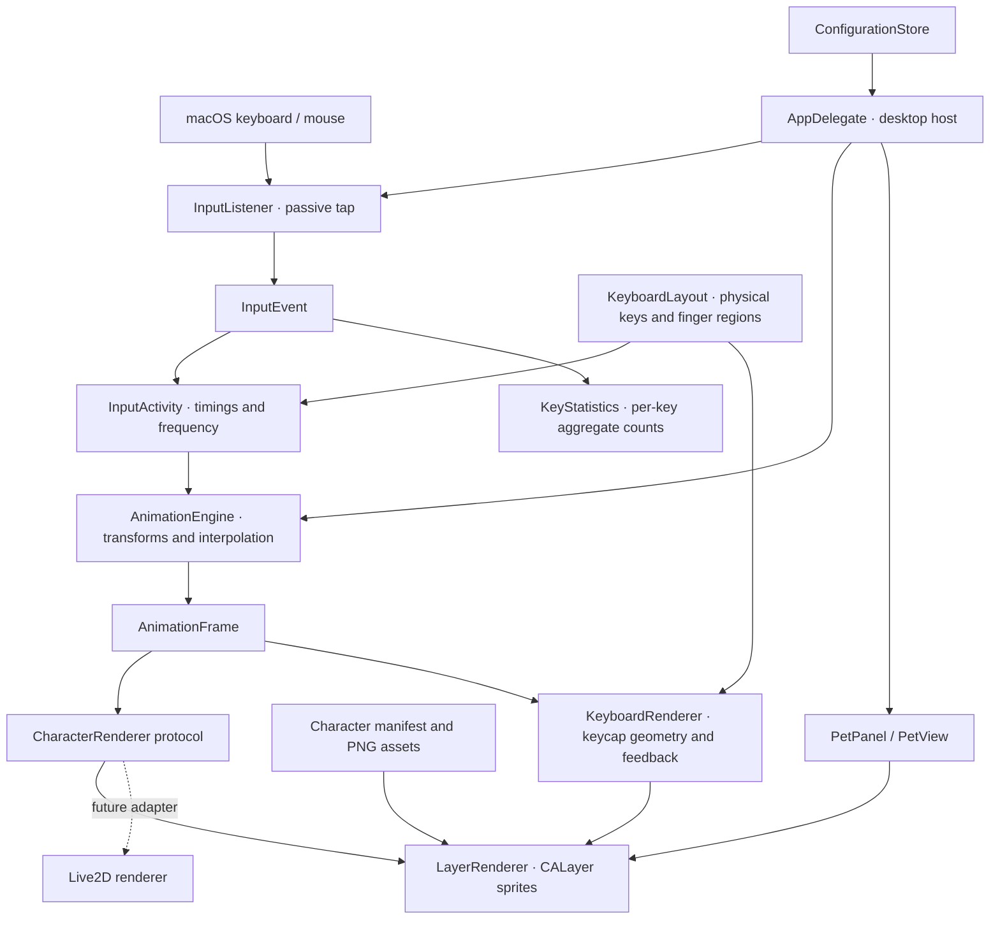

# Architecture and technology selection

## Typing renderer update (0.2.10)

The typing hand remains a rigid palm with five individually masked digits. `fingerDepthScale` defines a small projected curl and is shared by fingertip targeting and drawing, replacing the previous press-driven elongation. The left sleeve maps two existing sprite sections onto one curve from shoulder to wrist using affine triangle patches; shared quad vertices prevent open seams. This is a local CALayer renderer change: physical-key assignments, statistics, input events and the right mouse grip keep their existing behavior. Art-only CLI exports are separate from behavioral checks.

## Selection

Swift, AppKit and Core Animation suit a local Apple Silicon macOS companion. `NSPanel` supplies a transparent floating window without taking keyboard focus. `CALayer` renders PNG layers and applies transforms on an animation clock. A passive Core Graphics event tap supplies keyboard and mouse activity. The first version has no Live2D or network dependency.

| Approach | Benefits | Trade-offs |
|---|---|---|
| Native Swift / AppKit (selected) | Small runtime, transparent nonactivating window, native permissions and menu bar, no webview | macOS-specific window and input adapters; a Windows version needs another host |
| Electron | Portable UI and familiar web tools | Chromium runtime and extra native modules for global input and transparent-window behavior |
| Tauri | Smaller webview runtime than Electron | Additional Rust / JS bridge and platform-specific input work |
| Live2D first | Rich deformations and facial motion | Art rigging, runtime and licensing work delay the basic interaction loop |

## Boundaries

`ViolaCore` imports Foundation only. It owns input abstractions, the activity clock, typing start/stop, state selection, blink timing, transforms and configuration persistence. Unit tests use a controlled clock.

`ViolaDesktop` owns Core Graphics event decoding, permission status, native desktop windows, menus and CALayer rendering. UI updates and event callbacks run on the main run loop. The event tap is `listenOnly`, forwards every input unchanged and never posts synthetic events.

`CharacterAssets` loads a versioned JSON manifest and standalone PNG files. Layout and anchor changes do not require recompiling the animation core. An invalid or missing asset stops startup with an explicit error.

## Input contract

Mouse deltas remain unmodified in the passive input listener. Since 0.2.9, `AnimationEngine` reverses both response axes before clamping: `targetX -= dx * 0.65`, `targetY += dy * 0.55`. The renderer uses an upward-positive coordinate system, so this makes user right/up motion appear as left/down motion of Viola's grip. X travel remains ±32 and Y travel −22…+12 logical points, with the existing smoothing, recentering and click pressure. The operating system pointer is unchanged.

Raw events: `KEY_DOWN`, `KEY_UP`, `MOUSE_MOVE`, `LEFT_CLICK`, `RIGHT_CLICK`. The runtime event enum uses lowerCamelCase Swift names. `InputActivity` emits `TYPING_START` on the first key in a burst and `TYPING_STOP` after the release interval. Key repeat affects typing frequency without inflating the held-key count.

The keyboard listener checks `CGPreflightListenEventAccess` and attaches only after consent. Without that consent, a separate mouse monitor remains usable and keyboard monitoring is limited to the app's own UI. Settings distinguish these states. Grant changes are checked every two seconds; a manual reconnect is available. Physical keycodes drive keycap geometry, independent finger pressure and aggregate per-key press/repeat statistics. Only aggregate counters are persisted. Character strings, ordered keystrokes and typed text are not read or stored.

`KeyboardLayout` is the shared source for virtual codes, physical ANSI key positions and five left-hand finger regions. Viola's left hand reaches every visible key, including the right half of the keyboard; her right hand always retains the mouse grip. Keyboard and mouse activity are independent. Codes are checked against the installed SDK's HIToolbox `Events.h`. `KeyboardRenderer` draws the same key geometry it uses for key feedback and hand contact targets, avoiding a mismatch between an illustrated key grid and programmatic hit regions. Modifiers are observed via flags changes; Caps Lock toggles are treated as physical taps.

## Animation

Priority is Sleep → recent Click → Typing → recent Mouse_Move → Wake → Idle, based on monotonic elapsed times. A short key impulse ensures a single key press has a visible response. A periodic cycle driven by recent typing frequency supplements the impulses during bursts. Mouse offsets use exponential smoothing and decay toward zero. Click depression lasts a short interval. Blinks recur at deterministic pseudo-random intervals; sleep holds the closed-eye sprite.

The animation core generates `AnimationFrame` values; a renderer consumes those values. A future Live2D renderer should map these fields to rig parameters and reuse the input/configuration systems. AI / voice should submit companion actions through another independent adapter.

Active motions render up to 60 fps, idle up to 30 fps and sleep up to 15 fps. Hiding stops the frame timer. No text entry or other window focus is intercepted. Settings stay in Application Support, outside the source and app bundle.

Official API references: [passive event taps](https://developer.apple.com/documentation/coregraphics/cgeventtapoptions/listenonly), [NSPanel](https://developer.apple.com/documentation/appkit/nspanel), [window collection behavior](https://developer.apple.com/documentation/appkit/nswindow/collectionbehavior-swift.struct).

Physical key field: [CGEventField.keyboardEventKeycode](https://developer.apple.com/documentation/coregraphics/cgeventfield/keyboardeventkeycode).

## Parallel builds and idle companions (0.2.5)

`build_app.sh --parallel` gives the new app its own bundle identifier and `ViolaProfileDirectory` Info.plist value. The AppDelegate derives the storage directory from this value, seeds it from the old profile once, and then reads/writes only the new profile. The old application binary and grant remain intact.

AnimationEngine owns idle-leg easing and the randomized temporary friend-expression schedule. AnimationFrame exposes two leg angles, expression identity and opacity. LayerRenderer applies those values to independently masked knee-pivot sprites and registered facial feature layers. The keyboard's complete inner layer rotates toward the character; contact calculations use CALayer coordinate conversion through the same transform, including keycap depression.

## Layout overrides and joined desks (0.2.6)

`CharacterAssets(directory:manifestURL:)` accepts an optional profile layout while resolving local image filenames against the signed bundled asset directory. AppDelegate loads `character-layout.json` from its profile at startup and falls back to the bundled manifest if unavailable/invalid. Diagnostics expose `layoutPath`; gallery export accepts `--layout`. This makes geometry-only iterations independent of executable signing.

Two masked desk layers share the modular PNG. Compact keyboard geometry remains the single key-target transform. The sleeve solver distributes 58% of wrist translation to the elbow, with the remaining displacement in the forearm, preserving horizontal shoulder/cuff sections.

## Compound leg projection (0.2.7)

`AnimationFrame` carries separate fore/aft and lateral angles for each leg. The idle blend enters after two seconds without input and smoothly settles on activity; independent phases/frequencies avoid synchronized pendulum motion. The thigh sprite stays fixed at the hip, and the calf/foot starts at a knee pivot.

`LayerRenderer` divides each lower-leg texture into 48 overlapping strips. The projected vertical position and width scale use knee-relative depth and the configured perspective distance; a parent Z rotation adds lateral swing. This affine strip representation also works in `CALayer.render(in:)`, which does not reproduce non-affine 3D layer transforms. Foot diagnostics are calculated from the same projection. Production remains a lightweight layered 2D renderer with no 3D or skeletal dependency.

## Independent shoe interaction (0.2.8)

`ViolaCore/ShoeMotion.swift` owns the renderer-independent per-shoe phase machine: halfWorn → slipping → falling → grounded → recovering. Independent schedules start drops during idle; reduced-motion/sleep do not start new drops. A grounded shoe returns automatically after 6–9 seconds, or immediately begins recovering when `AnimationEngine.recoverShoe` receives its side. Recovery styles are toeHook and friendAssist; concurrent assistance is avoided.

`ViolaDesktop/ShoeRig.swift` owns rigid rear/front shoe layers, loose angular lag, detachment capture, ballistic fall, a damped bounce, floor placement, pickup targets and grounded hit regions. Toe recovery asks the leg renderer to reach the floor with the knee fixed; assistance moves the shoe along the friend's cupped palm and holds Viola's foot steady.

`PetView` maps pointer coordinates into the renderer canvas, distinguishes a grounded-shoe click from a window drag, and calls the engine through AppDelegate. Grounded hits use padded shoe bounds. `LayerRenderer` coordinates original resting arm visibility, helper sleeve/palm geometry, shoulder covers and registered facial patches. Diagnostics include shoe phases, positions, rotation, scale and the scheduled recovery style.

Toe-hook recovery now lasts 3.4 seconds. `ToeHookPose` supplies shared eased curves for foot insertion (0–26%), seating (26–30%), toe lift (30–44%), leg straightening (44–60%), forward travel (60–80%) and return (80–100%). The foot first reaches the rotated opening of the grounded independent shoe; pickup then eases into a continuous fitted transform. Both shoe atlases point toward canvas-left, so toe lift uses their shared negative rotation rather than their opposite floor-travel directions. Forward travel enlarges the lower leg and shoe by up to 18% and projects the foot upward, making depth visible. Existing thigh layers open slightly about the hip and scale by up to 5%; the calf knee follows the same transform. Normal idle geometry, layer order, floor placement and friend-assisted recovery are retained. A direct grounded-shoe click selects toe-hook recovery; scheduled recovery can still select friend assistance.

`--render-gallery <folder> --toe-hook-art [--layout <manifest>]` exports compact, independent left/right choreography poses and `toe-hook-poses.json`. This is an artwork export and runs no behavior checks or input simulation.
